# 🎨 零件图 · 第一批(侧视 v1)

> 来源:Akun 2026-07-16 交付 `monster_parts_side_v1.zip`(原始 1254×1254 透明 PNG ×25 + 绿幕源图;仓库里是裁边压缩后的 512px 版,原始包存档在 Yuda 的服务器)。
> 全部**严格侧视、朝右**;手/腿是单肢模块,可任意数量拼装;头部带短领口,长颈/分叉颈按 README 建议做成独立连接件(未来批次)。
>
> ⚠️ **下表"对应零件"列是 Yuda 的建议,全部待 Akun 拍板**——拍板后 demo 就能按映射自动换装(引擎侧管线已预留)。

## 头(5)

| 图 | 代号 | 对应零件(待定) |
|---|---|---|
| { width=140 } | `head_01` cyclops_brute 独眼壮汉 | 新手头? |
| 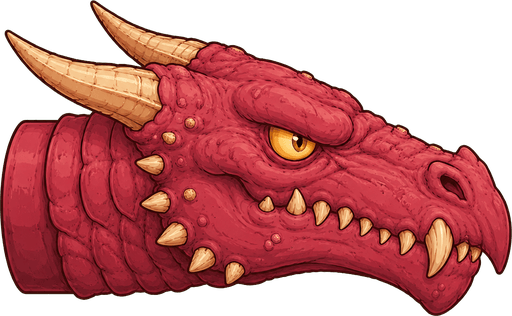{ width=140 } | `head_02` classic_dragon 经典龙头 | **喷火头**(龙=喷火,最顺) |
| 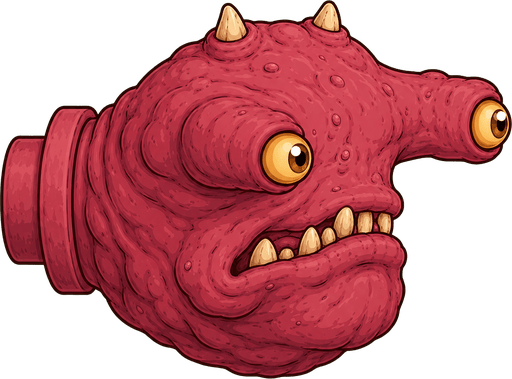{ width=140 } | `head_03` hammer_eye_mutant 锤眼突变 | 肿头? |
| { width=140 } | `head_04` eyeless_maw 无眼巨口 | 猛头?(纯嘴=纯输出) |
| 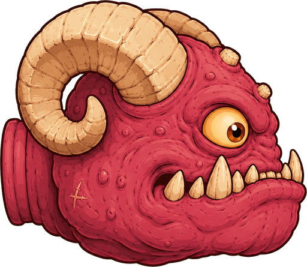{ width=140 } | `head_05` ram_snail_crusher 羊角撞锤 | **顶撞头**(羊角=顶撞,最顺) |

## 躯干(5 图,现有零件 3)

| 图 | 代号 | 对应零件(待定) |
|---|---|---|
| 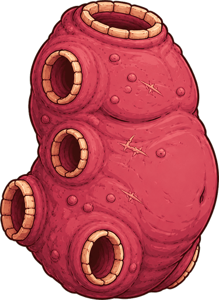{ width=140 } | `torso_01` barrel_brute 圆桶壮汉 | 有些肌肉的躯干? |
| 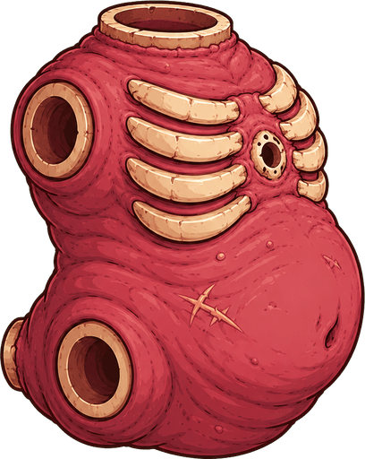{ width=140 } | `torso_02` ribbed_belly 肋排肚 | 新手躯干? |
| 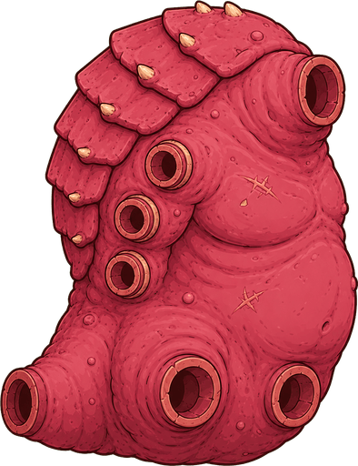{ width=140 } | `torso_03` plated_hunchback 甲背驼子 | (备用,将来新躯干) |
| 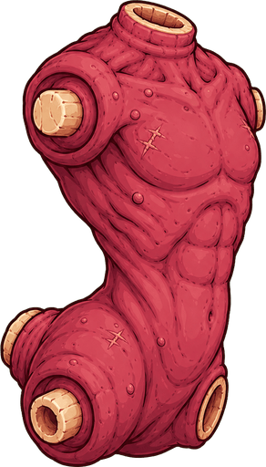{ width=140 } | `torso_04` sinewy_runner 精瘦跑者 | (备用) |
| 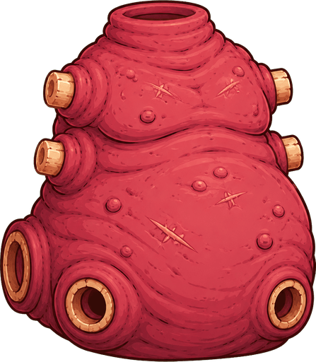{ width=140 } | `torso_05` bloated_brood 臃肿巢体 | 稍微长大的躯干? |

## 手 / 臂(5 图,现有零件 6)

| 图 | 代号 | 对应零件(待定) |
|---|---|---|
| 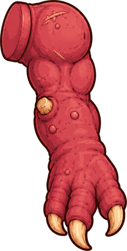{ width=140 } | `arm_01` basic_claw 基础爪 | 新手手? |
| 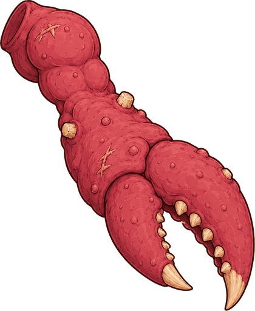{ width=140 } | `arm_02` giant_crab_pincer 巨蟹钳 | 猛爪? |
| 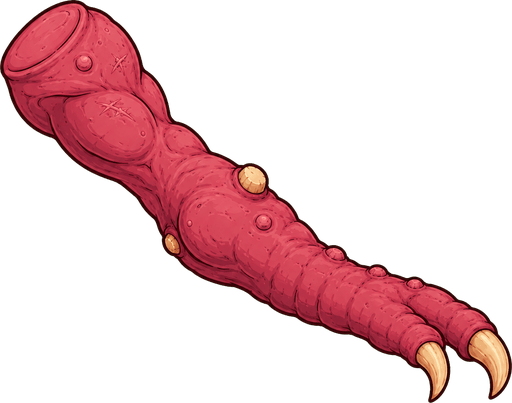{ width=140 } | `arm_03` tentacle_claw 触手爪 | 长有芽孢的手?(肉质=会重生) |
| 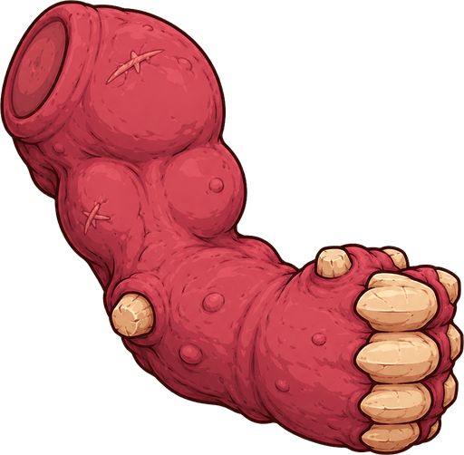{ width=140 } | `arm_04` bone_club_fist 骨锤拳 | 强力爪? |
| 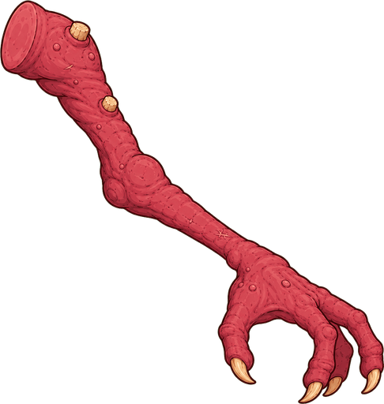{ width=140 } | `arm_05` lanky_grasper 细长抓手 | **抓握手**(名字都对上了) |

> 小手手暂无图;芽孢长出来的手可以复用本体图换个色。

## 腿(5 图,现有零件 5,数目正好)

| 图 | 代号 | 对应零件(待定) |
|---|---|---|
| 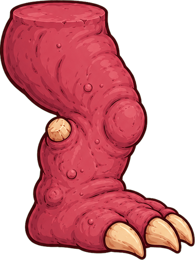{ width=140 } | `leg_01` stout_claw_foot 粗壮爪足 | 新手腿? |
| 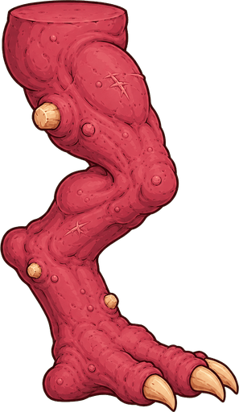{ width=140 } | `leg_02` digitigrade_hunter 趾行猎手 | 灵活的腿? |
| 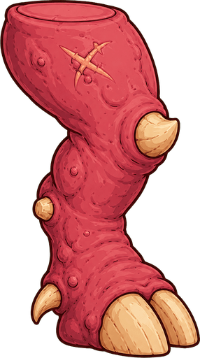{ width=140 } | `leg_03` horned_hoof 角质蹄 | **踢腿**(蹄=踢) |
| 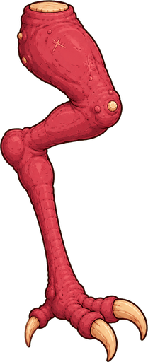{ width=140 } | `leg_04` insectile_flesh_stilt 虫式肉高跷 | 鞭腿? |
| 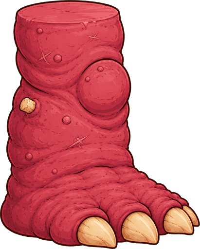{ width=140 } | `leg_05` pillar_stomper 柱式踏足 | 猛腿? |

## 尾(5 图,现有零件 2)

| 图 | 代号 | 对应零件(待定) |
|---|---|---|
| { width=140 } | `tail_01` basic_taper 基础锥尾 | 新手尾巴? |
| 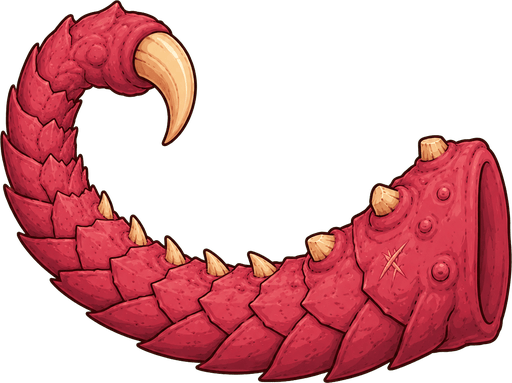{ width=140 } | `tail_02` dragon_scorpion 龙蝎尾 | 猛尾? |
| { width=140 } | `tail_03` bone_club 骨锤尾 | (备用,将来新尾巴/插件) |
| 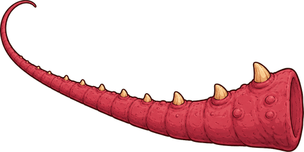{ width=140 } | `tail_04` whip_spine 鞭脊尾 | (备用) |
| 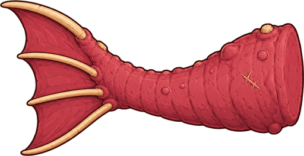{ width=140 } | `tail_05` finned_swimmer 鳍尾 | (备用) |

---

**工程侧接下来**(映射拍板后):demo 纸偶换 PNG——部件按映射自动贴图、没图的零件继续色块兜底、击破变灰掉落(07-03 定的表现层路线)。需要 Akun 做的只有一件事:把上面的"?"改成他想要的对应关系(直接改这页就行)。
